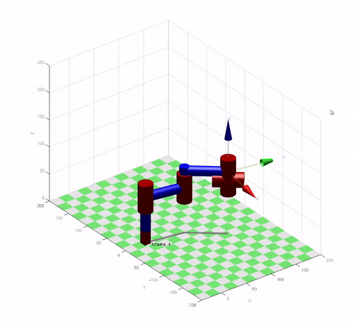

# Mechatronics and AI Engineer

## [View my Linkedin](https://www.linkedin.com/in/mikko-de-torres/) | [View my YouTube Channel](https://www.youtube.com/@mikkodetorres)
## Technical Skills: 
## Tools: Python, SQL, Excel, MATLAB, C++, Power BI, SolidWorks, Arduino, GitHub, Machine Learning, Machine Vision
## Specialization: Industrial Robotics, Artificial Intelligence

## Education 
- #### BS, Mechatronics Engineering | Batangas State University - The National Engineering University (_April 2012_)
- #### MS, Artificial Intelligence  (_15 acquired units_) | Batangas State University - The National Engineering University (_August 2023 - Present_)

## Work Experience
**[Lecturer 1](https://www.linkedin.com/in/mikko-de-torres/) @ Batangas State University (_August 2019 - Present_)**

Courses taught: Machine Learning and Data Science, Robotics 1 and 2, Microprocessors and Microelectronics, Control Systems Engineering
- Guided students in [Python](https://www.python.org/), [MATLAB](https://www.mathworks.com/products/matlab.html) and [C++](https://isocpp.org/) programming
- Developed machine learning projects and simulations

**[Project Technical Assistant II](https://www.linkedin.com/in/mikko-de-torres/) @ Digital Technology Center - Batangas State University (_September 2023 - August 2024_)**

DOST-TAPI funded project “Fabrication of Commercial Ready Prototype of the Collapsible Solar Power Station for Farms”
- Specializing in CAD design specifically in [SolidWorks](https://www.solidworks.com/)

**[Sustaining Automation Engineer](https://www.linkedin.com/in/mikko-de-torres/) @ Tomodachi Global Resources Inc. (_July 2017 - June 2018_)**

Skills acquired: Data Science, Problem Solving, Automation, Data Analysis, [Python](https://www.python.org/)
- Developed robotic control systems using [Python](https://www.python.org/)
- Implemented software solutions for automation processes

### Projects
### 1. <a href="#about-mvp">Machine Vision Project</a>
### 2. <a href="#about-dsp">Data Science Project</a>
### 3. <a href="#about-csp">Mechanical Design Project</a>
### 4. <a href="#about-mp">MATLAB Project</a> 
### 5. <a href="#about-ros">ROS Project</a>

## Project Details

### 1. [Machine Vision System for Inspecting Weld Quality on Stainless Steel using HDR Cameras and Deep Learning](https://github.com/MikkoDT/Machine_Vision_System_for_Inspecting_Weld_Quality_on_Stainless_Steel)
<h3 id="about-mvp">Machine Vision Project Content:</h3>

This project presents the development and evaluation of a machine vision system with Python in Jupyter Notebook for inspecting weld quality on stainless steel using HDR cameras and deep learning. The system employed a transfer learning approach, leveraging a pre-trained VGG16 convolutional neural network (CNN) for feature extraction and adapting it to the specific task of weld defect classification.

### 2. [Machine Learning Model Productionization for Gala Groceries](https://github.com/MikkoDT/Cognizant_AI_Experience_Program/tree/main)
#### Artificial Intelligence Virtual Experience Program of Cognizant
<h3 id="about-dsp">Data Science and Data Analysis Project Content:</h3>

In this project, I developed a Python module to productionize a machine learning model for Gala Groceries. The model, originally created in a Jupyter notebook, was transformed into a production-ready Python script that can be executed to load data, train the model, and report performance metrics. The goal was to automate the training pipeline, ensuring scalability and ease of integration into production environments.

### 3. [Collapsible Solar Power Station for Farms](https://github.com/MikkoDT/11th_collapsibleProject)
I designed the mechanical structure and mechanism using SolidWorks for a portable solar power station tailored for farms. The system integrates photovoltaic panels and a battery storage unit, enabling clean and reliable energy generation. Its collapsible design ensures ease of transportation, deployment, and storage, offering flexibility and mobility for diverse farming needs.

<h3 id="about-csp">Mechanical Design Project Content:</h3>

#### Brochure and Instruction Materials

#### Deployed Project

### 4. Mechanical Manipulator types programmed in MATLAB
<h3 id="about-mp">MATLAB Projects Content:</h3>

This section showcases my proficiency in using MATLAB and its toolboxes for simulating various robotic manipulator types. These simulations are valuable tools for understanding robot kinematics, dynamics, and control strategies.

Simulations:

1. [MATLAB Cartesian manipulator](https://github.com/MikkoDT/MATLAB_Cartesian_manipulator) - This program simulates a Cartesian robot, commonly used for tasks requiring precise positioning in a rectangular workspace.
2. [MATLAB Cylindrical manipulator](https://github.com/MikkoDT/MATLAB_Cylindrical_manipulator) - This program simulates a cylindrical robot, offering flexibility in reaching points within a cylindrical workspace.
3. [MATLAB Spherical manipulator](https://github.com/MikkoDT/MATLAB_Spherical_manipulator) - This program simulates a spherical robot, ideal for tasks requiring manipulation around a central point.
4. [MATLAB Articulated manipulator](https://github.com/MikkoDT/MATLAB_Articulated_manipulator) - This program simulates an articulated robot, offering a high degree of freedom for complex movements.
5. [MATLAB SCARA manipulator](https://github.com/MikkoDT/MATLAB_SCARA_manipulator) - This program simulates a Selective Compliance Assembly Robot Arm (SCARA), commonly used for pick-and-place applications.
6. [6-DOF SCARA V3 Robotics Toolbox](https://github.com/MikkoDT/6-DOF-SCARA-RoboticsToolbox) - This project demonstrates the use of the Robotics Toolbox by Peter Corke for simulating a 6-DOF SCARA manipulator.

Additional Notes:

These simulations were developed for my lectures in Robotics, part of the Mechatronics Engineering curriculum I teach for 3rd-year students.  Leveraging MATLAB reinforces my strong foundation in this versatile programming language and its applications in robotics and AI (including Machine Learning and Machine Vision).

Visualization: SCARA V3 Simulation in Robotics Toolbox

The library used in this MATLAB and python program is [Robotics Toolbox by Peter Corke](https://github.com/petercorke/robotics-toolbox-matlab).

You need to have Robotics Toolbox library by Peter Corke to run the program.

### 5. [3-DOF Articulated Mechanical Manipulator in ROS with ARDUINO](https://github.com/MikkoDT/Arduinobot_ROS_Project)
<h3 id="about-ros">ROS Project Content:</h3>
This project focuses on the development of a 3-DOF articulated mechanical manipulator using ROS (Robot Operating System) and Arduino. The manipulator was controlled via C++ in ROS for real-time control and simulation. Python was used to solve the kinematics and perform mathematical computations for efficient motion planning. The project aimed to combine robotics control with ROS to create an interactive, functional robot system.

## GitHub Repositories I'm using in my Lectures
### 1. [MexEE402_AI](https://github.com/MikkoDT/MexEE402_AI) for Electives 2: Data Science and Machine Learning
Focuses on Python programming for data analysis, machine learning, and AI applications. Students learn to work with libraries such as pandas, scikit-learn, and matplotlib. Practical applications involve developing machine learning models and deploying them.

- GitHub Repository: [MexEE402_AI](https://github.com/MikkoDT/MexEE402_AI)

Contains lecture notes, practical exercises, and projects on data science and machine learning. The repository introduces students to essential topics like data manipulation, supervised and unsupervised learning, and model productionization.

### 2. [Robotics_MEXE_3rdYearCourse](https://github.com/MikkoDT/Robotics_MEXE_3rdYearCourse) for Robotics 1 & 2
The course covers kinematics, dynamics, and control of robotic systems. Practical coding tasks focus on C++ and Python to implement control algorithms and simulations.

- GitHub Repository: [Robotics_MEXE_3rdYearCourse](https://github.com/MikkoDT/Robotics_MEXE_3rdYearCourse)

Includes resources for students to explore robot programming, simulation tasks, and control systems design. Topics include inverse kinematics and real-time control strategies.
 
### Mechatronics and Robotics Engineering [YouTube](https://www.youtube.com/@mikkodetorres) Channel
This YouTube channel is dedicated to Mechatronics and Robotics Engineering, providing educational content aimed at enhancing skills and knowledge in various engineering disciplines.

#### Content Overview:
1. Robotics 1: Introduction to foundational concepts of robotics, including kinematics, dynamics, and control systems.

2. Robotics 2: Advanced topics in robotics, focusing on sensor integration, robotic vision, and autonomous systems.

3. Data Science in MS Excel: Tutorials on data manipulation and visualization techniques using Microsoft Excel for effective data analysis.

4. Git and GitHub Lectures: Instructional videos on version control systems, covering essential Git commands and collaboration techniques using GitHub.

5. Basic Workshop and Machining: Practical guides on machining techniques, tools, and safety protocols for effective fabrication and assembly.

Explore the videos to deepen your understanding of these vital subjects in engineering and stay updated with the latest projects and tutorials.

[YouTube](https://www.youtube.com/@mikkodetorres) Channel

