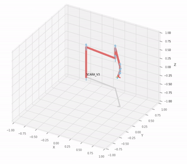

# Mechatronics and AI Engineer

## [View my Linkedin](https://www.linkedin.com/in/mikko-de-torres/) | [View my YouTube Channel](https://www.youtube.com/@mikkodetorres)
## Technical Skills: 
## Tools: Python, SQL, Excel, MATLAB, C++, Power BI, SolidWorks, Arduino, GitHub, Machine Learning, Machine Vision
## Specialization: Industrial Robotics, Artificial Intelligence

## Education 
- #### BS, Mechatronics Engineering | Batangas State University - The National Engineering University (_April 2012_)
- #### MS, Artificial Intelligence  (_15 acquired units_) | Batangas State University - The National Engineering University (_August 2023 - Present_)

## Work Experience
**[Lecturer 1](https://www.linkedin.com/in/mikko-de-torres/) @ Batangas State University (_August 2019 - Present_)**

Courses taught: Machine Learning and Data Science, Robotics 1 and 2, Microprocessors and Microelectronics, Control Systems Engineering
- Guided students in [Python](https://www.python.org/), [MATLAB](https://www.mathworks.com/products/matlab.html) and [C++](https://isocpp.org/) programming
- Developed machine learning projects and simulations

**[Project Technical Assistant II](https://www.linkedin.com/in/mikko-de-torres/) @ Digital Technology Center - Batangas State University (_September 2023 - August 2024_)**

DOST-TAPI funded project “Fabrication of Commercial Ready Prototype of the Collapsible Solar Power Station for Farms”
- Specializing in CAD design specifically in [SolidWorks](https://www.solidworks.com/)

**[Sustaining Automation Engineer](https://www.linkedin.com/in/mikko-de-torres/) @ Tomodachi Global Resources Inc. (_July 2017 - June 2018_)**

Skills acquired: Data Science, Problem Solving, Automation, Data Analysis, [Python](https://www.python.org/)
- Developed robotic control systems using [Python](https://www.python.org/)
- Implemented software solutions for automation processes

## Projects
## 1. [Machine Vision](#Machine-Vision-Project-Content)
## 2. [Data Science and Data Analysis](#Data-Science-and-Data-Analysis-Project-Content)
## 3. <a href="#about-mp">MATLAB Project</a> 

### [Machine Vision System for Inspecting Weld Quality on Stainless Steel using HDR Cameras and Deep Learning](https://github.com/MikkoDT/Machine_Vision_System_for_Inspecting_Weld_Quality_on_Stainless_Steel)

## Machine Vision Project Content:

This project presents the development and evaluation of a machine vision system with Python in Jupyter Notebook for inspecting weld quality on stainless steel using HDR cameras and deep learning. The system employed a transfer learning approach, leveraging a pre-trained VGG16 convolutional neural network (CNN) for feature extraction and adapting it to the specific task of weld defect classification.

**Technologies Used**:

- [Python](https://www.python.org/): Core language for machine vision system and deep learning model development.
- [Jupyter Notebook](https://jupyter.org/): Development environment for writing and testing code.
- HDR Cameras: Used to capture high-quality weld images with precise details for defect classification.
- VGG16 CNN: Pre-trained convolutional neural network for feature extraction and defect classification.
- Data Augmentation: Techniques like normalization, cropping, flipping, and rotation to enhance model generalizability.
- Evaluation Metrics: Metrics such as accuracy, precision, recall, F1-score, and confusion matrix to evaluate model performance.
  
This project highlights the effective use of transfer learning for automated inspection in quality control.

### [Machine Learning Model Productionization for Gala Groceries](https://github.com/MikkoDT/Cognizant_AI_Experience_Program/tree/main)
#### Artificial Intelligence Virtual Experience Program of Cognizant

## Data Science and Data Analysis Project Content:

In this project, I developed a Python module to productionize a machine learning model for Gala Groceries. The model, originally created in a Jupyter notebook, was transformed into a production-ready Python script that can be executed to load data, train the model, and report performance metrics. The goal was to automate the training pipeline, ensuring scalability and ease of integration into production environments.

**Technologies Used**:

- [Python](https://www.python.org/): Core programming language for module development.
- [Pandas](https://pandas.pydata.org/): Data manipulation and analysis.
- [Scikit-learn](https://scikit-learn.org/stable/): Model training, cross-validation, and evaluation.
- [Random Forest Regressor](https://scikit-learn.org/stable/modules/generated/sklearn.ensemble.RandomForestRegressor.html): Supervised learning algorithm for regression tasks.
- [StandardScaler](https://scikit-learn.org/stable/modules/generated/sklearn.preprocessing.StandardScaler.html): Feature scaling for optimal model performance.

This project showcases my ability to transition machine learning models from development to production, ensuring robust performance while following best coding practices for clarity and maintainability.

### 3. 5 Mechanical Manipulator types programmed in MATLAB
<h2 id="about-mp">About MP</h2>
## MATLAB Projects Content:

1. [MATLAB Cartesian manipulator](https://github.com/MikkoDT/MATLAB_Cartesian_manipulator)
2. [MATLAB Cylindrical manipulator](https://github.com/MikkoDT/MATLAB_Cylindrical_manipulator)
3. [MATLAB Spherical manipulator](https://github.com/MikkoDT/MATLAB_Spherical_manipulator)
4. [MATLAB Articulated manipulator](https://github.com/MikkoDT/MATLAB_Articulated_manipulator)
5. [MATLAB SCARA manipulator](https://github.com/MikkoDT/MATLAB_SCARA_manipulator)
6. [6-DOF SCARA V3 Robotics Toolbox](https://github.com/MikkoDT/6-DOF-SCARA-RoboticsToolbox)

SCARA V3 Simulation in Robotics Toolbox

The library used in this python program is Robotics Toolbox by Peter Corke.

You need to have Robotics Toolbox library by Peter Corke to run the program.

### GitHub Repositories I'm using in my Lectures
### 1. [MexEE402_AI](https://github.com/MikkoDT/MexEE402_AI) for Electives 2: Data Science and Machine Learning
Focuses on Python programming for data analysis, machine learning, and AI applications. Students learn to work with libraries such as pandas, scikit-learn, and matplotlib. Practical applications involve developing machine learning models and deploying them.

- GitHub Repository: [MexEE402_AI](https://github.com/MikkoDT/MexEE402_AI)

Contains lecture notes, practical exercises, and projects on data science and machine learning. The repository introduces students to essential topics like data manipulation, supervised and unsupervised learning, and model productionization.

**Technologies Used**:

- [Python](https://www.python.org/): Core programming language for module development.
- [Pandas](https://pandas.pydata.org/): Data manipulation and analysis.
- [Scikit-learn](https://scikit-learn.org/stable/): Model training, cross-validation, and evaluation.
- [Random Forest Regressor](https://scikit-learn.org/stable/modules/generated/sklearn.ensemble.RandomForestRegressor.html): Supervised learning algorithm for regression tasks.
- [StandardScaler](https://scikit-learn.org/stable/modules/generated/sklearn.preprocessing.StandardScaler.html): Feature scaling for optimal model performance.

### 2. [Robotics_MEXE_3rdYearCourse](https://github.com/MikkoDT/Robotics_MEXE_3rdYearCourse) for Robotics 1 & 2
The course covers kinematics, dynamics, and control of robotic systems. Practical coding tasks focus on C++ and Python to implement control algorithms and simulations.

- GitHub Repository: [Robotics_MEXE_3rdYearCourse](https://github.com/MikkoDT/Robotics_MEXE_3rdYearCourse)

Includes resources for students to explore robot programming, simulation tasks, and control systems design. Topics include inverse kinematics and real-time control strategies.

**Technologies Used**:
- [MATLAB](https://www.mathworks.com/products/matlab.html): Programming platform for numerical computing and simulations.
- [Robotics Toolbox by Peter Corke](https://petercorke.com/toolboxes/robotics-toolbox/): Toolbox for simulating and working with robotic manipulators.
- [C++](https://isocpp.org/): High-performance programming language for system and application development.
- [SolidWorks](https://www.solidworks.com/): CAD software for 3D design and engineering.

 
### Mechatronics and Robotics Engineering [YouTube](https://www.youtube.com/@mikkodetorres) Channel
This YouTube channel is dedicated to Mechatronics and Robotics Engineering, providing educational content aimed at enhancing skills and knowledge in various engineering disciplines.

#### Content Overview:
1. Robotics 1: Introduction to foundational concepts of robotics, including kinematics, dynamics, and control systems.

2. Robotics 2: Advanced topics in robotics, focusing on sensor integration, robotic vision, and autonomous systems.

3. Data Science in MS Excel: Tutorials on data manipulation and visualization techniques using Microsoft Excel for effective data analysis.

4. Git and GitHub Lectures: Instructional videos on version control systems, covering essential Git commands and collaboration techniques using GitHub.

5. Basic Workshop and Machining: Practical guides on machining techniques, tools, and safety protocols for effective fabrication and assembly.

Explore the videos to deepen your understanding of these vital subjects in engineering and stay updated with the latest projects and tutorials.

[YouTube](https://www.youtube.com/@mikkodetorres) Channel

